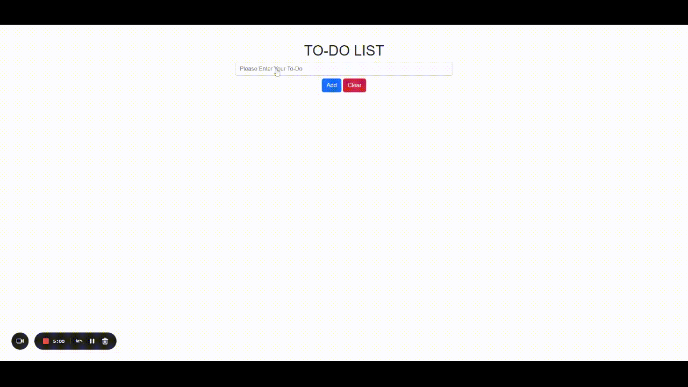

# TO-DO LIST APP

  

**TO-DO LIST APP** made by HTML, CSS, Bootstrap and JavaScript. Homework for 4. Sezon Yetişkinler Hafta Sonu.

You can write and add your To-Do with Add Button.  
Clear Button deletes the all To-Do's in the List.  
If you click the To-Do, you can mark is as done.  
If you double-click the To-Do, you can delete it from the list. 

---

---

## Languages

